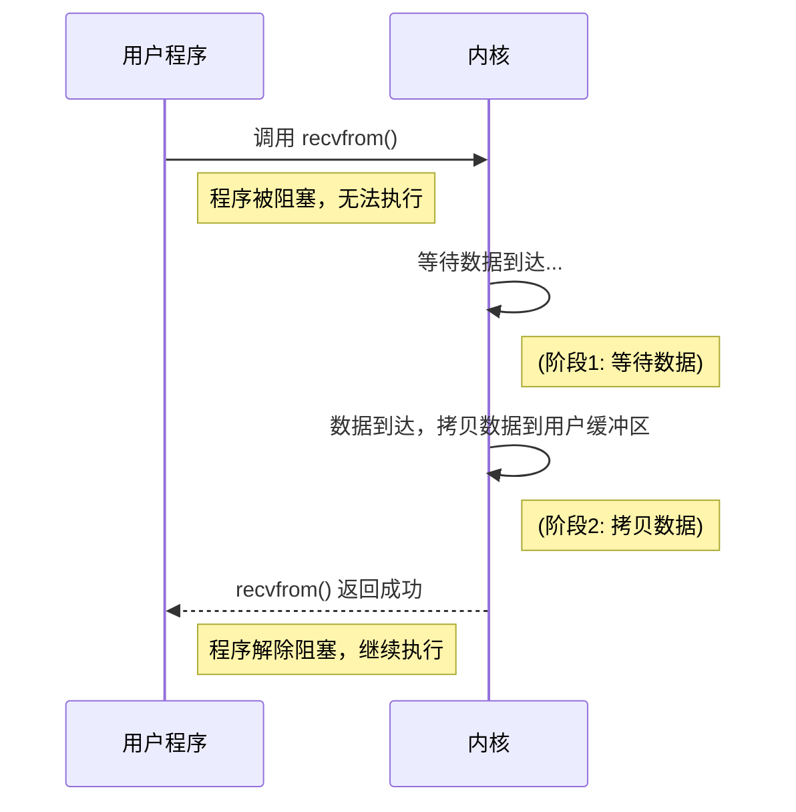
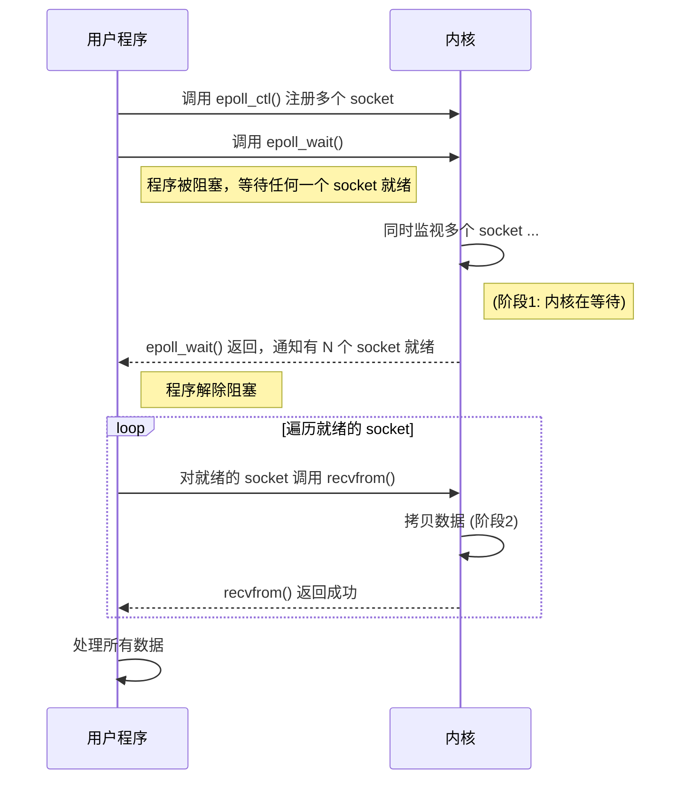
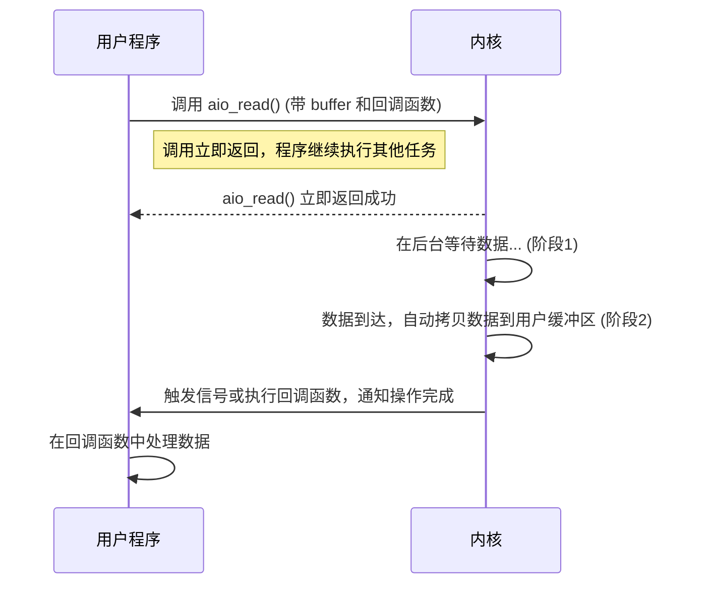

### IO操作的两个核心阶段
1. **等待数据准备**：内核等待数据就绪，时间完全取决于对端。
2. **拷贝数据到用户态**: 内核将缓冲区的内容拷贝到用户态。
(存在从网卡拷贝数据到内核缓冲区的阶段)

### 阻塞 I/O (Blocking I/O - BIO)


### 非阻塞 I/O (Non-blocking I/O - NIO)
```mermaid
sequenceDiagram
    participant UserApp as 用户程序
    participant Kernel as 内核

    loop 轮询检查
        UserApp->>Kernel: 调用 recvfrom
        alt 数据未准备好
            Kernel-->>UserApp: 立即返回错误 EWOULDBLOCK
            UserApp->>UserApp: 执行其他任务...
        else 数据已准备好
            Kernel->>Kernel: 拷贝数据到用户缓冲区
            Kernel-->>UserApp: recvfrom 返回成功
            break
        end
    end
    UserApp->>UserApp: 处理数据
```

### I/O 多路复用 (I/O Multiplexing)


### 异步 I/O (Asynchronous I/O - AIO)

